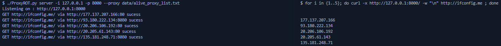
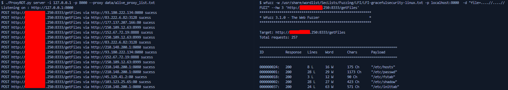

# Proxy ROT

## Description :

The goal of this project is to create an HTTP proxy in order to send HTTP requests througt multiple HTTP proxies and rotate with all of them.

There will be multiple modules in this project:

- Scraping
- Scaning
- Validate
- Server

## Modules :

### Scraping

The scraping modules will make requests to apis and scrape web content of public proxy websites like https://www.google-proxy.net/ or https://www.proxy-list.download/ and export all thoses proxy and sort them by type.

### Scanning

Scanning module will scan the internet in order to open proxy.
This module will come with an optional flag to check if the proxies are valid or not.

### Validate

Validate module goal is to check a list of proxy and test for each if they are valid or not, will come with aditionnal parameter in order to know the respon,se time of each proxy.

### Server

This module will create an HTTP Proxy Server based on inputs, respectively ip and port and bind on it.
All requests made to this proxy will route the requests to different proxies.
The proxie will be choosed by different methods : randomly, based on response time or more.
We also provide an errors checks in order to remove non working proxies and try with an another one.

# Example

### Curl

### Wfuzz

## Todo

- Faster validate module, improve multithreading and maybe add delay
- Create Scraping module
- Create Parsing module
- Support HTTPS
- Support gzip madness
- Change back the Server.Forward_Request method to sockets. Using of requests isnt sufficient.
- Considering project change of HTTP to Socks in the futur.
- See later..